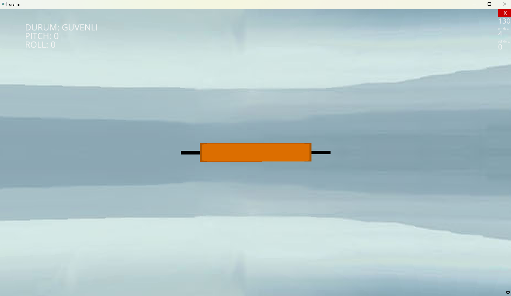
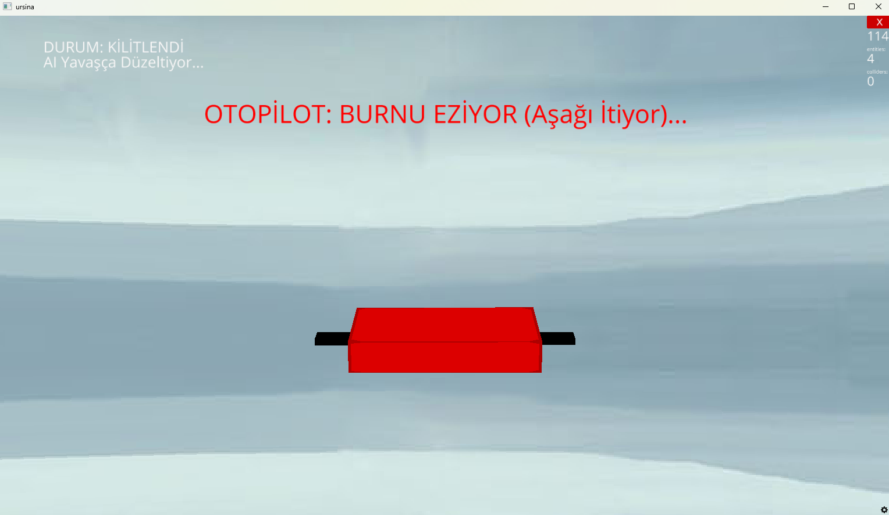
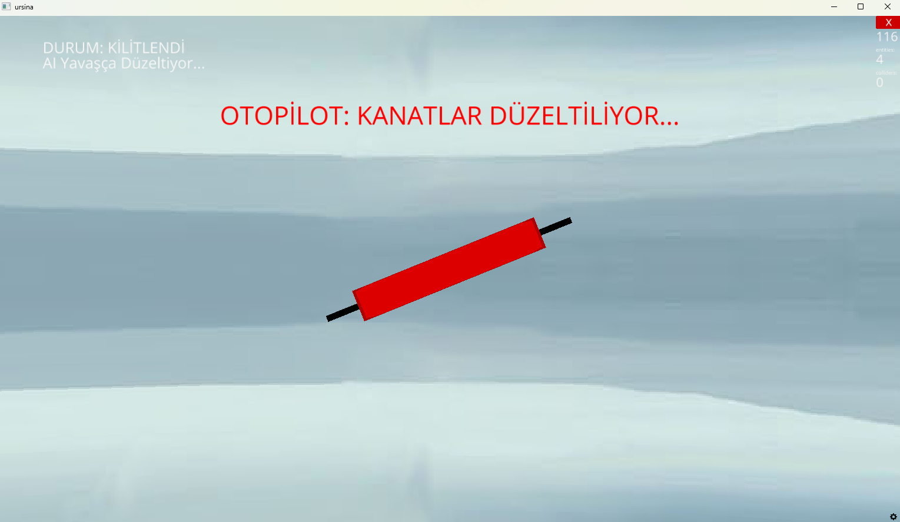

# ✈️ Eğitim Amaçlı: AI Destekli Uçuş Kontrol ve Zarf Koruma Simülasyonu

Bu proje, Python ve Gömülü Yazılım (Embedded Software) prensiplerini öğrenme sürecimde geliştirdiğim, **"Software-in-the-Loop" (SIL)** tabanlı bir uçuş kontrol simülasyonudur. Gerçek bir F-16 yazılımı değildir; modern savaş uçaklarındaki **"Flight Envelope Protection" (Uçuş Zarfı Koruma)** sistemlerinin mantığını kavramak amacıyla oluşturulmuş bir prototiptir.

## 🎯 Proje Amacı
Savunma sanayii yazılımlarının sensör verilerini nasıl temizlediğini ve pilot hatalarını nasıl engellediğini anlamak amacıyla;
1.  **Gürültülü sensör verilerini** temizleyen matematiksel modelleri (Kalman Filtresi),
2.  **Tehlikeli manevraları** (Stall riski) algılayan Yapay Zeka modellerini,
3.  Otonom karar alıp uçağı düzelten **Otopilot** algoritmalarını simüle etmektir.

## 🚀 Temel Özellikler
* **Canlı 3D Simülasyon:** Ursina Engine kullanılarak oluşturulan, fizik kurallarına (atalet) uyan görsel arayüz.
* **Sinyal İşleme (Kalman Filtresi):** Sensörlerden gelen titrek ve gürültülü verilerin matematiksel olarak temizlenmesi.
* **Yapay Zeka (AI Pilot):** Random Forest algoritması ile uçağın anlık açılarının (Pitch/Roll) "Güvenli" veya "Tehlikeli" olarak sınıflandırılması.
* **Otopilot Kilit Sistemi (Auto-Recovery):** AI tehlike sezerse, pilotun kontrollerini devre dışı bırakır ve uçağı otomatik olarak güvenli pozisyona getirir.
* **Modüler Mimari:** Karar mekanizması (`ai_pilot.py`) ile simülasyon motorunun (`flight_sim.py`) birbirinden ayrılması.

## 🛠️ Kullanılan Araçlar
Bu projeyi geliştirirken şu teknolojilerden faydalandım:

* **Python** (Ana programlama dili)
* **Ursina Engine** (3D Simülasyon ve Fizik Motoru için)
* **Scikit-Learn** (Random Forest AI modelini kurmak için)
* **NumPy** (Matematiksel hesaplamalar için)
* **PyInstaller** (Projeyi .exe formatına dönüştürmek için)

## 📷 Ekran Görüntüleri

### 1. Güvenli Uçuş Modu
Pilotun tam kontrole sahip olduğu, verilerin temiz aktığı durum. Turuncu kutu (veya uçak modeli) pilotun komutlarına uyar.



### 2. Otopilot Müdahalesi (Stall Uyarısı - Pitch)
Pilot uçağı tehlikeli bir açıya (örn: >30 derece Pitch) getirdiğinde sistem **KIRMIZI** alarma geçer, kontrolü kilitler ve "BURNU EZİYOR/KALDIRIYOR" uyarısı vererek uçağı düzeltir.



### 3. Otopilot Müdahalesi (Kanat Düzeltme - Roll)
Uçak kanatları aşırı yattığında (örn: >45 derece) sistem devreye girer ve "KANATLAR DÜZELTİLİYOR" uyarısı vererek uçağı yatay konuma getirir.


## 💿 Nasıl Çalıştırılır?

**Seçenek 1: Kaynak Koddan Çalıştırma**
Gerekli kütüphaneleri yükleyin:
```bash
pip install -r requirements.txt

```

Simülasyonu başlatın:

```bash
python flight_sim.py

```

## 📝 Not

Bu proje eğitim ve hobi amaçlı geliştirilmiştir. Kullanılan fizik motoru ve sensör gürültüleri, gerçek dünyadaki IMU sensörlerini taklit etmek üzere sentetik olarak (rastgele) üretilmiştir.

**Geliştirici:** Arda Karadağ | Bilgisayar Programcılığı Öğrencisi

